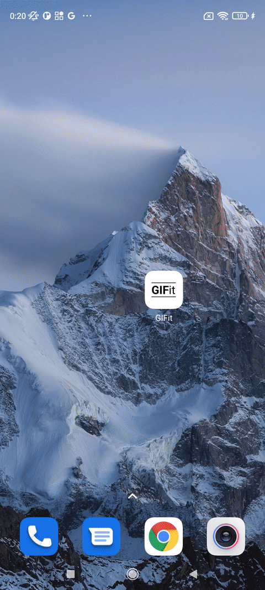
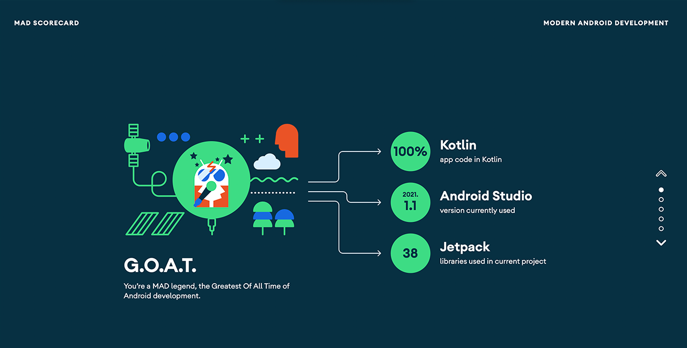
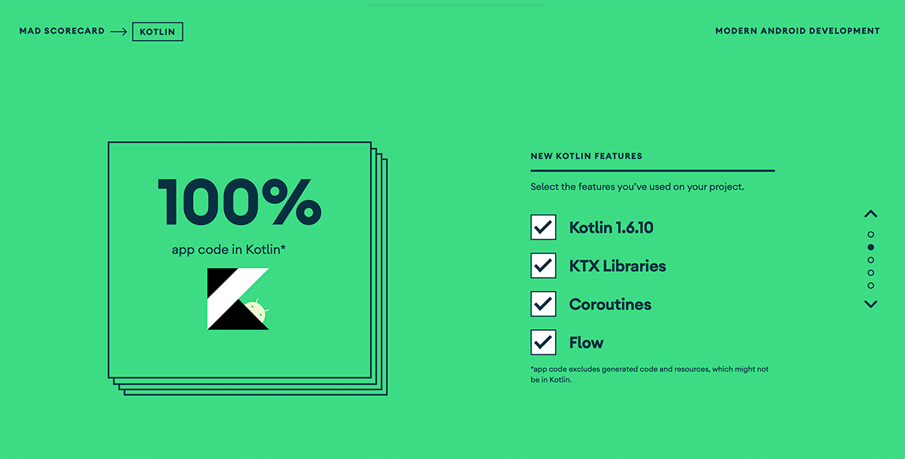
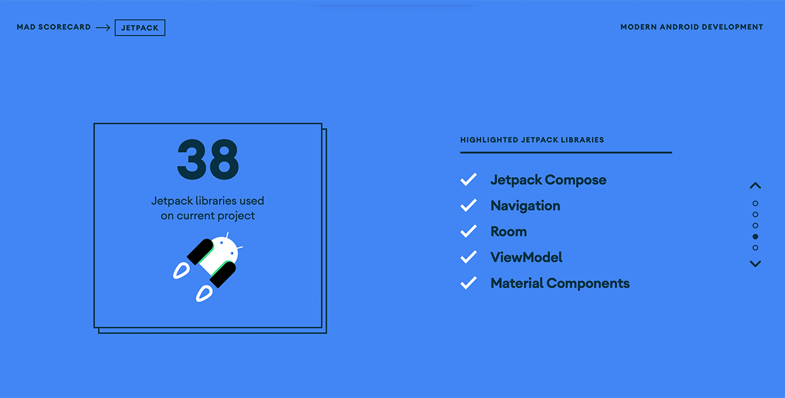

# GIFit

[](https://opensource.org/licenses/Apache-2.0)
[](https://github.com/TheTeamPotato/GIFit/releases)

[](http://kotlinlang.org)

GIFit is a full-featured MVVM Android app built entirely with Jetpack Compose. It supports more than 10+ source languages for translation to English with a visual GIF image.

<p align="center">
  
  
  
</p>

## Features

- Add search result to favorites
- Inspect your search history
- Supports offline usage
- Supports 13 different languages
  - 🇨🇳 Chinese
  - 🇩🇰 Danish
  - 🇳🇱 Dutch
  - 🇫🇮 Finnish
  - 🇫🇷 French
  - 🇩🇪 German
  - 🇮🇹 Italian
  - 🇯🇵 Japanese
  - 🇰🇷 Korean
  - 🇳🇴 Norwegian
  - 🇪🇸 Spanish
  - 🇸🇪 Swedish
  - 🇹🇷 Turkish

## 📲 Download

Go to the [Releases](https://github.com/TheTeamPotato/GIFit/releases) to download the latest APK.

## 🛠 Tech Stack

### Architecture

- 100% Kotlin based, including Gradle files
- MVVM Clean & Multi-Module Architecture
- Repository Pattern

### Libraries

- Minimum SDK level 21 + based on [Kotlin](https://kotlinlang.org/)

- buildSrc + Kotlin DSL - Manage dependencies and modules implementation easily and much clearer than the traditional way

- Coil - Display image and GIF animations
  - [Coil Compose](https://coil-kt.github.io/coil/compose/)
  - [Coil GIF](https://coil-kt.github.io/coil/gifs/)
- [DataStore](https://developer.android.com/topic/libraries/architecture/datastore) - Manage local data

- [Coroutines](https://github.com/Kotlin/kotlinx.coroutines) & [Flow](https://kotlin.github.io/kotlinx.coroutines/kotlinx-coroutines-core/kotlinx.coroutines.flow/) - Perform asynchronous operations

- [Hilt](https://dagger.dev/hilt/) - for dependency injection

- Jetpack Libraries
  - [Compose](https://developer.android.com/jetpack/compose/documentation) - Build modern declarative Android UI
  - [Compose Navigation](https://developer.android.com/jetpack/compose/navigation) - Navigate between composables
  - [Lifecycle](https://developer.android.com/jetpack/compose/lifecycle) - Observe lifecycle state changes
  - [Room](https://developer.android.com/training/data-storage/room) - Manage CRUD operations
  - [ViewModel](https://developer.android.com/topic/libraries/architecture/viewmodel) - Store UI related data
  
- [Ktor Client](https://ktor.io/docs/client.html) - Execute network service calls
- [Lottie Compose](https://airbnb.io/lottie/#/android-compose) - Animate sweet Lottie animations
- [Splash API](https://developer.android.com/guide/topics/ui/splash-screen) - Customize your Splash without effort
- [Timber](https://github.com/JakeWharton/timber) - Log your messages

### Services

- [GIPHY API Service](https://developers.giphy.com/) - GIF API
- [Google Translation | ML Kit](https://developers.google.com/ml-kit/language/translation) - Translate text in more than 50 languages
- [Google TTS Service](https://developer.android.com/reference/android/speech/tts/TextToSpeech) - For TTS(Text to Speech)
- [Lottie](https://airbnb.io/lottie/#/android-compose) - Animation library

## How to get the Giphy API key?

Register [here](https://developers.giphy.com/dashboard/) and get your own API key for your builds.

## 🏆 MAD Scores





## 👩‍💻 Contribution

All contributions are welcomed. Feel free to open PR. If you've found an error in this sample, please file an issue:</br>
<https://github.com/TheTeamPotato/GIFit/issues>
</br>
PRs are encouraged.

## ❤️ Find this repository useful?

Support the repository by becoming a __[stargazer](hhttps://github.com/TheTeamPotato/GIFit/stargazers)__ 🎖 </br>

## License

```xml
Designed and developed by yektasarioglu (Yekta Sarioglu) and isoguzay (Ismail Oguzhan Ay)

Licensed under the Apache License, Version 2.0 (the "License");
you may not use this file except in compliance with the License.
You may obtain a copy of the License at

   http://www.apache.org/licenses/LICENSE-2.0

Unless required by applicable law or agreed to in writing, software
distributed under the License is distributed on an "AS IS" BASIS,
WITHOUT WARRANTIES OR CONDITIONS OF ANY KIND, either express or implied.
See the License for the specific language governing permissions and
limitations under the License.
```
